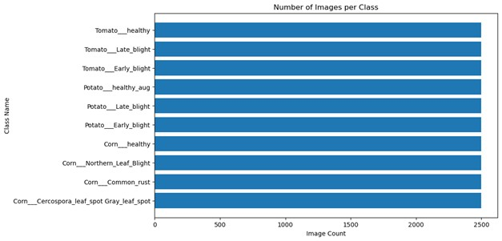
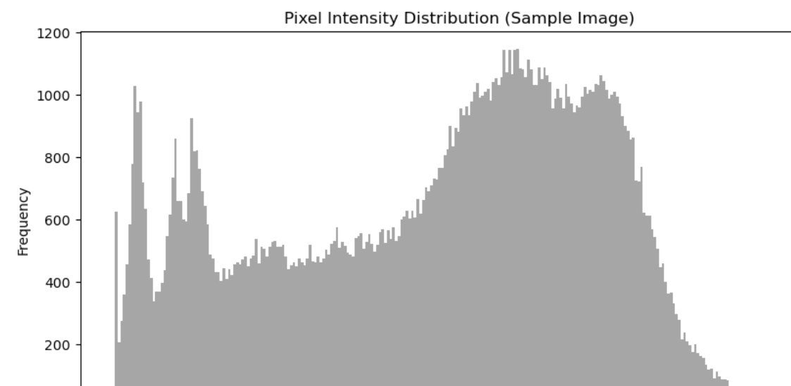
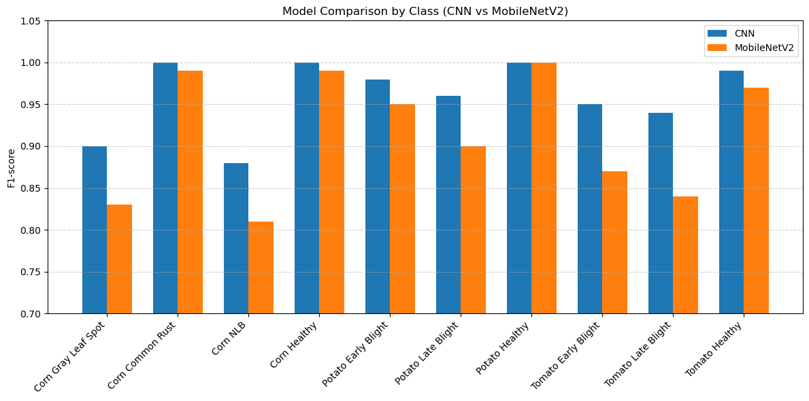
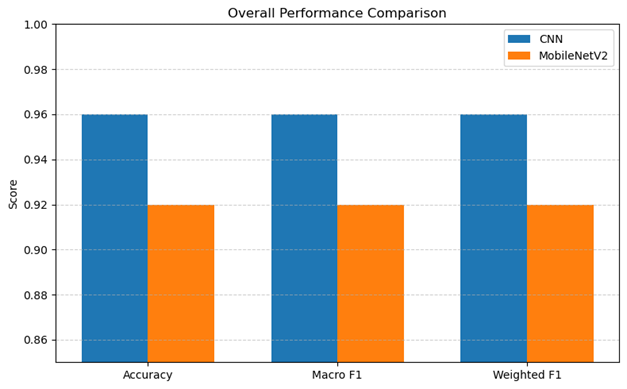

# PLANT LEAF DISEASE DETECTION
## STEP 1: Business understanding
### Project Overview
Agriculture is a key pillar of food security and economic growth globally and particularly in developing countries where a large percentage of the population depends on farming for their livelihood. However, crop diseases remain one of the major threats to agricultural productivity, leading to reduced yields, financial losses, and food insecurity. In this project, we focus on the detection of plant leaf diseases in corn, tomato and potato crops using image classification techniques. The goal is to build a machine learning model capable of identifying whether a plant leaf is healthy or diseased based on visual symptoms. By automating disease detection, farmers can take timely action to prevent disease spread, improve crop health, and reduce reliance on manual inspection, which is often slow, inaccurate, and requires expert knowledge.

### Problem Statement
Crop diseases such as blight, leaf spots and rust significantly affect the productivity of corn, tomato and potato plants. Traditional disease detection relies heavily on manual observation by farmers or agricultural experts, which is both time-consuming and prone to human error. There is therefore a need for a technological solution that can accurately and efficiently detect and classify plant leaf diseases at an early stage. This will help farmers make informed decisions on disease management, reduce crop losses, and improve overall agricultural productivity.

### Business Objectives
#### Main Objective
To develop an image classification model that can automatically detect and classify leaf diseases in corn, tomato, and potato plants.

#### Specific Objectives
1. To collect and preprocess images of corn, tomato and potato leaves (both healthy and diseased).
2. To train and evaluate a machine learning model capable of identifying disease types based on leaf images.
3. To compare model performance using different classification algorithms.
4. To provide a simple, user-friendly interface that can assist farmers in identifying crop diseases through image uploads.
#### Research Questions
1. How can a machine learning model be developed to classify tweets as positive or negative?
2. What methods can be used to clean and preprocess raw Twitter text data to prepare it for analysis?
3. How can the sentiment distribution between Apple and Google products be explored and visualized effectively?
4. Which evaluation metrics (such as accuracy and precision) can be used to assess the model’s performance and ensure its reliability?
#### Success Criteria
1. What types of diseases affect corn, tomato, and potato leaves?
2. Can image classification accurately identify diseased leaves?
3. Which model gives the best results in detecting plant leaf diseases?
4. How can the model’s results be presented in a way that is easy for farmers to understand?

## STEP 2: Data Understanding

The dataset used in this project comes from [Mendeley Data — “PlantVillage Dataset: Potato Leaf Disease”](https://data.mendeley.com/datasets/tywbtsjrjv/1)

It contains labeled images of potato leaves under 10 categories
Data Summary:
- Total images: 25000 original images.
- Classes: 10
- Format: JPEG
- Resolution: Variable, to be resized to 224×224 for model training.
- Image collection: Captured under field and controlled lighting conditions.

classes in the Dataset:

- Corn___Cercospora_leaf_spot Gray_leaf_spot: 2500 images
- Corn___Common_rust: 2500 images
- Corn___Northern_Leaf_Blight: 2500 images
- Corn___healthy: 2500 images
- Potato___Early_blight: 2500 images
- Potato___Late_blight: 2500 images
- Potato___healthy_aug: 2500 images
- Tomato___Early_blight: 2500 images
- Tomato___Late_blight: 2500 images
- Tomato___healthy: 2500 images

### Libraries Used
1. Data Manipulation: numpy, pandas
2. Visualization: matplotlib, seaborn
3. TensorFlow:  For training and inference of neural networks

## STEP 3: Data Preparation and Exploratory Data Analysis (EDA)
### Data Preparation
- Removing duplicates
- Splitting the dataset
- Resizing the images

### EDA 
Below are some of the selected visualizations made from the project analysis:

1. Data Distribution 

2. Pixel Intensity Distribution

## STEP 4: Modelling
### Approach
Dataset Split: The dataset was split into training, validation and testing sets (e.g. 70/15/15 ratio) 
Models Built:
- **Convolutional Neural Network**
- **MobileNetV2 transfer learning network**

### Evaluation Metrics:
Accuracy, Precision, Recall, F1-Score, Confusion Matrix.
 
## STEP 5: Evaluation and Results
### Model Performance
In this project, two models a custom Convolutional Neural Network (CNN) and a MobileNetV2 transfer learning model were trained and evaluated on a plant disease dataset containing 10 distinct crop disease classes. Each class had a balanced number of images (2,500), ensuring fair representation across categories. The CNN outperformed MobileNetV2 in both accuracy and F1-score, CNN acheiving an accuracy of 96% while MobileNetV2 acheived an accuracy of 92% indicating that the custom architecture was able to learn more robust features specific to this dataset. All models achieved near-perfect performance on healthy leaf classes, with most errors occurring in visually similar disease types (e.g. Corn Northern Leaf Blight vs Cercospora Leaf Spot).

### Key visualizations
1. Model Comparison by Class - 
This bar chart displays the model comparison of our classification models.

2. Overall model comparison- 

## STEP 6: Recommendations 
### Model Choice 
The CNN model should be selected for deployment since it achieves the highest accuracy (96%) and balanced precision-recall performance.
### Practical Application
Deploy the CNN model via Streamlit for farmers or agronomists to upload leaf images and receive:
- The predicted disease class.
- Recommendations on treatment or management.
### Future Work
- Extend the dataset to include more plant species and real-world images which include varied lighting and backgrounds.
- Implement Grad-CAM visualizations to highlight which leaf areas the model focuses on.
- Consider edge deployment (e.g., TensorFlow Lite) for use in mobile devices.

### PROJECT COLLABORATORS
1. [Zipporah Muriithi](https://github.com/zippy345)
2. [Vincent Toroitich](https://github.com/Limo-Vincent)
3. [Royal Mbugua](https://github.com/Kihiuroyal)
4. [Marion Mengich](https://github.com/Marionmengich)

### How to Run the Project
Clone the repository and Run the notebook: [Plant leaf disease detection.ipynb](https://github.com/zippy345/Plant_leaf_disease_classifier_project/blob/master/Plant%20leaf%20disease%20detection.ipynb)

### Navigating the Repository
The repository contains:

* Jupyter Notebook: [Plant leaf disease detection.ipynb](https://github.com/zippy345/Plant_leaf_disease_classifier_project/blob/master/Plant%20leaf%20disease%20detection.ipynb)
* Presentation Slides: PDF file [Leaf it to us-compressed.pdf](https://github.com/zippy345/Plant_leaf_disease_classifier_project/blob/master/Leaf%20it%20to%20us-compressed.pdf)
* Data Report: [data report](https://github.com/zippy345/Plant_leaf_disease_classifier_project/blob/master/Leaf%20It%20To%20Us%20Team's%20Data%20Report.pdf) 
* Model deployment: [Model_deploy](https://github.com/zippy345/Plant_leaf_disease_classifier_project/tree/master/Model_deploy)
* README.md: Project overview 
* .gitignore: Specifies files to ignore in version control

